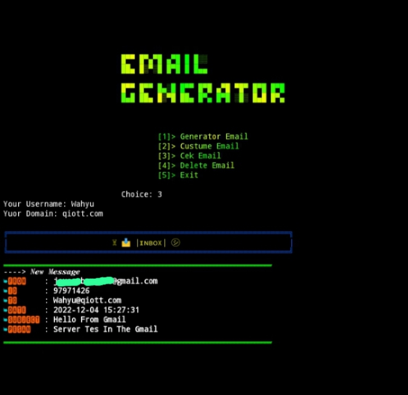

# FAKE-EMAIL8

## Comand Program
#####
**`pkg update & pkg upgrade`**
#####
**`pkg install python`**
#####
**`pkg install git`**
#####
**`git clone https://github.com/BarCode221/FAKE-EMAIL8`**

# RUN PROGRAM
#####
**`cd FAKE-EMAIL8`**
#####
**`pip install -r requirement.txt`**
#####
**`python Run.py`**
